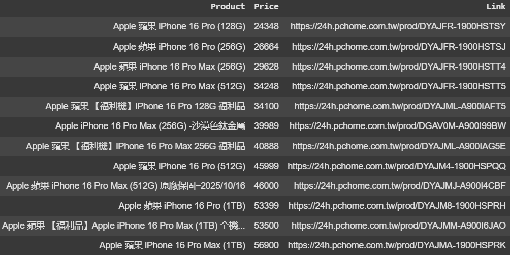

## 專案概述
此專案展示了如何使用 **Selenium** 進行網頁爬蟲，並專注於確保數據的準確性和一致性。目標是：
* 透過自動化測試從 **PChome** 擷取產品資訊（如名稱、價格和鏈接）。
* 模擬真實用戶操作，進行搜尋功能的測試。
* 驗證擷取的數據是否正確，並確保其結構化以便進一步分析。

作為 **SQA 實習生**，此專案展示了：
- 搜尋功能的自動化測試。
- 確保擷取的數據正確無誤，並且結構化處理。
- 為未來測試和可擴展性改進提供基礎。

---

## 💡 主要功能
- **自動化搜尋測試**：模擬在 PChome 網站上進行搜尋，確保結果一致且準確。
- **數據擷取驗證**：檢查擷取到的產品名稱、價格和鏈接是否正確。
- **測試自動化**：展示如何利用 Selenium 進行基於瀏覽器的測試，確保搜尋功能的可靠性和效能。

---

## 🔧 使用技術
- **Python**
- **Selenium** (用於網頁自動化和測試)
- **Pandas** (用於數據處理和驗證)
- **WebDriver** (用於自動化與網頁瀏覽器的交互)

---

## 🚜 操作流程
1. **自動化搜尋輸入**：程式透過模擬搜尋功能，將查詢輸入 PChome 搜尋框。
2. **數據擷取**：從搜尋結果中擷取產品資訊，如名稱、價格和鏈接。
3. **數據驗證**：確認擷取到的數據是否正確，檢查產品名稱、價格和鏈接的正確性。
4. **結構化數據輸出**：將數據儲存在 Pandas DataFrame 中，以便後續驗證或匯出。

---

## 🧪 測試重點
- **測試自動化**：使用 Selenium 自動化測試網頁，模擬不同的搜尋查詢，驗證搜尋結果的準確性。
- **回歸測試**：確保在網站改動後，爬蟲邏輯依然正確運作。
- **數據品質保證**：驗證爬取的數據是否準確，並且格式正確，確保不會有缺失或錯誤的產品資訊。

---

## 📊 範例輸出

```python
產品名稱: "Apple 蘋果 iPhone 16 Pro (128G)"
價格: "$24348"
鏈接: "https://24h.pchome.com.tw/prod/DYAJFR-1900HSTSY"


